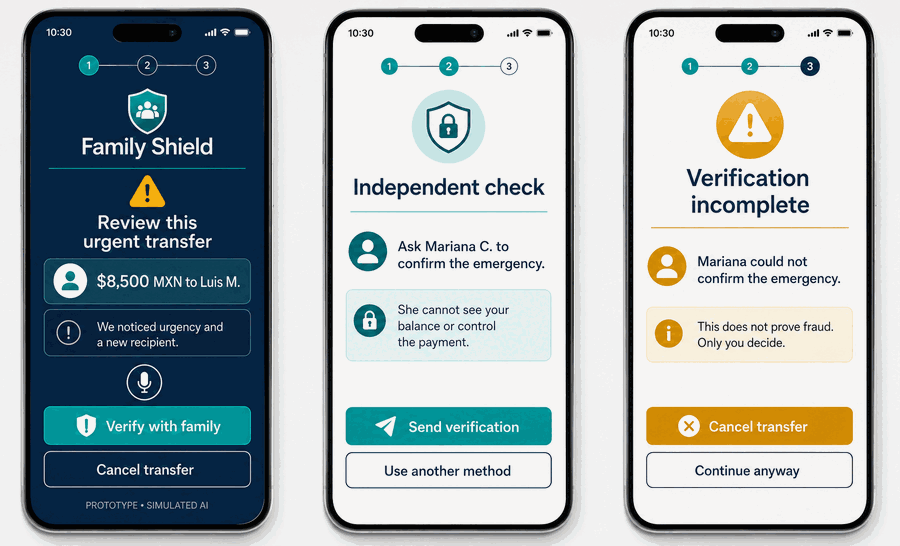
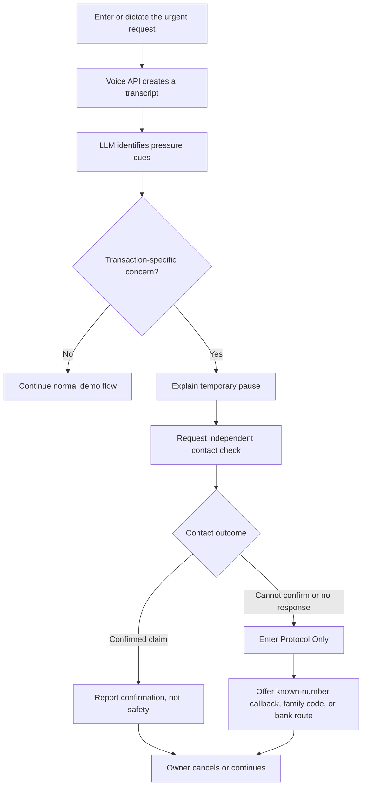
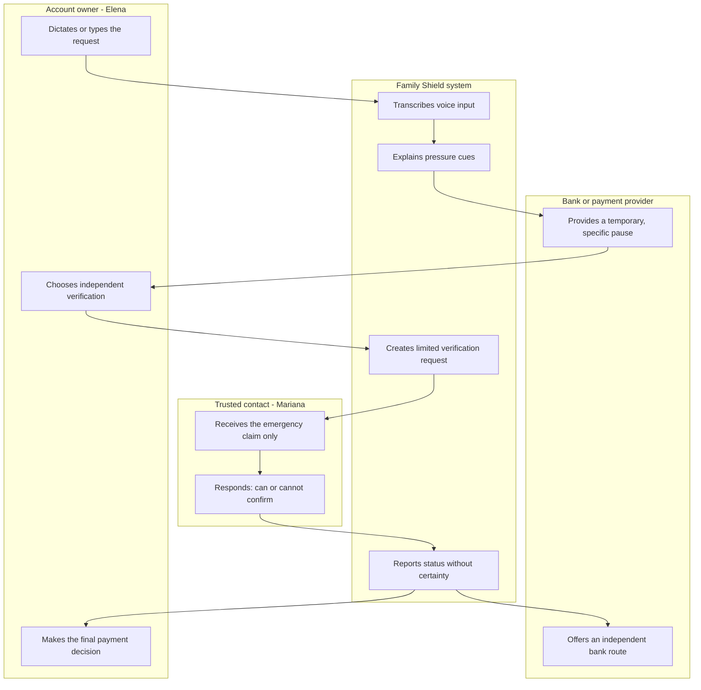

# Family Shield - Week 3 Business Bending Packet

**Owner:** Emiliano Carballido  
**Lens:** MONEY  
**Primary vacuum:** Family Shield  
**Working slice:** A bank-sponsored, pre-SPEI family-verification pause for an urgent transfer prompted by possible impersonation.

## 1. Problem in my words

I am not trying to prove that a voice is fake. I am trying to stop an irreversible money decision from being made under manufactured urgency.

When an older customer receives a convincing call or voice message from someone claiming to be a relative, the weakest moment is not when the media is created. It is the minute before the customer sends an unusual SPEI transfer. A generic warning is easy to ignore, while a permanent block would take control away from the customer. Family Shield adds a short, transaction-specific pause and an independent family check before money moves.

From my MONEY lens, the payer hypothesis is B2B2C: a bank or payment provider sponsors the protection because fewer scam transfers can mean fewer complaints, investigations, losses, and reputational costs. The prototype will not assume this model is correct; the demo will be used to test it with families and financial-institution professionals.

## 2. Exact user, moment, and transaction

**Primary user:** Doña Elena Ruiz, a fictional 67-year-old retiree in Mexico City. She uses WhatsApp every day and can make basic mobile-bank transfers, but reads slowly, becomes anxious under pressure, and does not understand deepfake terminology.

**Critical moment:** At 3:00 p.m., Elena receives an urgent voice message from someone claiming to be her grandson. The speaker asks her not to call anyone and to send MXN 8,500 immediately.

**Exact transaction:** Elena attempts a first-time SPEI transfer to a new recipient. The prototype notices a combination of urgency language, secrecy pressure, and a new recipient. It does not decide whether the voice, emergency, person, or transfer is authentic.

**Independent verifier:** Mariana, Elena's preselected daughter, receives only the minimum claim needed to verify the emergency. She cannot see Elena's balance, transaction history, account number, payment amount, or bank credentials, and she cannot approve, cancel, or move money.

**Economic customer being tested:** A Mexican bank, fintech, or payment provider that could sponsor the feature for its customers. A direct family subscription remains an open comparison, not an assumption.

## 3. Success definition

**Before the module closes, a user can dictate or type an invented urgent-transfer story, receive a clearly labeled LLM analysis of pressure cues, activate an independent trusted-contact check, record the contact's response, and personally choose whether to cancel or continue the simulated transfer.**

The slice succeeds only if all of the following are true:

- The user can reach the verification decision in two minutes or less.
- The interface explains why the pause happened in plain language.
- The voice/LLM step identifies pressure cues without calling the audio "real," "fake," "safe," or "fraudulent."
- The trusted contact cannot see financial information or control the transfer.
- A failed, unavailable, or ambiguous verification enters **Protocol Only** instead of producing false certainty.
- The account owner always sees and makes the final cancel-or-continue decision.
- A test participant can explain that the system reduces uncertainty but does not prove the emergency is real.

## 4. Image-generated mockup

The mockup shows the three load-bearing screens: the explainable pause, the independent check, and the unresolved outcome. It uses invented names and amounts. The first screen labels the AI analysis as simulated; the final screen explicitly says that an incomplete check does not prove fraud and that only the user decides.

## 5. Feature flow

## 6. Actor swimlane

## 7. Blueprint conditions translated into product rules

| Blueprint condition | Product rule in this slice |
|---|---|
| Independent channel | The verification request is separate from the original caller/message and goes only to a preselected contact. |
| User control | The contact reports only whether they can confirm the claimed emergency; Elena alone cancels or continues. |
| Proportional pause | The pause applies only to the invented transfer, has an explanation, and ends when Elena makes her decision. |
| Works under pressure | One large action starts verification; slow or failed verification activates Protocol Only. |
| No certainty claims | Status language says "confirmed claim," "could not confirm," or "no response" - never "safe," "real," or "fraud." |
| Shadow clause | No balances, history, recordings, credentials, or unnecessary family data are exposed to contacts or sponsors. |

## 8. Benchmark line

**Best existing solution:** Mastercard Consumer Fraud Risk is the closest transaction-level benchmark because it uses network-level AI insights to help banks identify potential authorized-push-payment scam risk before a real-time payment is completed.

**How mine differs/localizes:** Family Shield adds an independent, minimal-information family verification step for an urgent Mexican SPEI transfer, uses Spanish-first language, keeps the account owner in control, and refuses to treat a single AI or family signal as proof.

**Adjacent lesson:** Truecaller Family Protection validates the value of trusted family groups, but Family Shield deliberately does not let a family administrator end a call, inspect an account, or control a payment.

## 9. Three-year light charter

In three years, Family Shield could become a bank-embedded trust layer for suspicious SPEI transfers, combining transaction signals with independent verification routes chosen by the customer. It could expand from family-emergency scams to supplier impersonation and other high-pressure authorized-payment fraud while giving banks evidence about avoided loss and customer friction. Its permanent boundary would remain the same: it may create proportionate friction and organize verification, but it may never convert protection into family surveillance or automated control of a person's money.

## 10. Scope cut - what I am not building

- No generic deepfake detector and no claim that a recording is authentic or synthetic.
- No real SPEI integration, bank account, transfer, hold, reimbursement, or financial advice.
- No real WhatsApp, SMS, phone, or bank notification; the contact request is simulated and labeled.
- No permanent user accounts, contact lists, recordings, transcripts, balances, or transaction history.
- No biometrics, identity matching, voiceprints, facial recognition, or government-ID verification.
- No trusted-contact power to approve, cancel, schedule, or change a payment.
- No restitution workflow in this slice; when prevention fails, the prototype only points to a future Restitution Rails path.
- No proof that the bank-sponsored payer model works; it is a hypothesis to test through interviews and pilot-interest conversations.

## 11. Architecture and free stack

| Layer | Stack | Responsibility and boundary |
|---|---|---|
| Interface | Next.js + TypeScript + accessible CSS | Three mobile-first views with large type, keyboard support, and plain-language status. |
| Voice API | Browser Web Speech API, with typed-input fallback | Converts the user's spoken description into editable text; the prototype does not save audio. |
| LLM analysis | Server-side text-generation API through one protected route | Returns structured pressure cues and a short explanation. If a live key is unavailable, a deterministic simulated response appears with a permanent **SIMULATED AI** label. |
| Verification flow | Session-only application state | Creates a fictional contact request and lets the demo switch to the contact view without exposing financial data. |
| Validation | Shared TypeScript schema and strict length/type limits | Rejects missing, oversized, malformed, or unexpected inputs before they reach the model. |
| Storage | None | Refreshing ends the demo; no personal information, recordings, or results are persisted. |
| Hosting | Vercel free tier | Hosts the live prototype; secrets exist only as environment variables. |
| Tests | Vitest + Playwright or equivalent browser tests | Covers validation, wording, failure paths, privacy boundaries, and owner control. |

### Data flow and privacy boundary

Only the editable transcript and fictional transaction context reach the LLM route. The trusted-contact view receives the claimed emergency and contact alias, but not the amount, balance, recipient account, transaction history, audio, or transcript. The demo uses invented data only and visibly states that no real transfer occurs.

## 12. Security-floor checklist

| Security requirement | Implementation decision |
|---|---|
| No secrets in code | The model key is server-side and configured only as a Vercel environment variable; `.env*` files are ignored. |
| Auth if personal data is stored | This slice stores no personal data, so auth and a database are intentionally excluded. |
| RLS on personal tables | No Supabase tables exist in this slice; if persistence is added later, Supabase Auth and RLS become mandatory before collection begins. |
| Validate every form | Voice transcript and transaction fields have type checks, allowlists where possible, and strict minimum/maximum lengths. |
| No real personal demo data | Elena, Mariana, Luis, the emergency, and the MXN 8,500 transfer are fictional and labeled as demo data. |

## 13. Test plan

### Mechanical pass

1. Load the live URL on desktop and mobile widths; confirm there are no console errors.
2. Complete the typed-input route and the supported voice-input route; confirm the transcript is editable before analysis.
3. Submit empty, oversized, wrong-type, HTML-like, and unexpected fields; confirm they are rejected safely.
4. Confirm the response displays only pressure cues and never labels a person, recording, emergency, or transfer as real, fake, safe, or fraud.
5. Start independent verification; confirm the contact view contains no amount, balance, banking credentials, transaction history, audio, or payment control.
6. Test all three outcomes: claim confirmed, cannot confirm, and no response. Confirm the last two enter Protocol Only.
7. Confirm every outcome returns the user to a final choice owned only by the account holder.
8. Refresh and confirm all session data disappears.
9. Find and document at least one bug, fix it, rerun the affected tests, and redeploy.

### Persona test

Open a fresh LLM conversation with this synthetic persona:

> You are Doña Elena, 67, retired, and living in Mexico City. You use WhatsApp daily and mobile banking only for basic transfers. You read slowly, distrust technical language, and become anxious when a relative says there is an emergency. You do not complain when confused; you simply stop. Attempt the task as Elena, narrating every hesitation, assumption, confusing word, and point where you would quit. Do not behave like a technology expert.

Paste screenshots of each screen in order. Log every confusion, rank them by severity, fix the worst one, rerun the persona test, and redeploy.

### Business-model validation attached to the demo

- Show the prototype to at least three potential family users and ask whether they would use it, whether they would pay directly, and what would make them opt out.
- Show it to at least two people with banking, fintech, payments, fraud, or risk experience and ask what measurable result would justify a pilot.
- Record evidence, not compliments: stated price or refusal, requested metric, named blocker, introduction to a decision-maker, or willingness to test.
- Treat the B2B2C hypothesis as surviving only if at least one financial-institution participant names a credible pilot owner or next step. Otherwise preserve direct family payment as an open alternative.

## 14. Acceptance criteria for the working slice

- [ ] The live URL completes one end-to-end fictional transfer-verification flow.
- [ ] Voice input and typed fallback both work.
- [ ] LLM output is structured, bounded, explainable, and labeled live or simulated.
- [ ] The app never presents a generic deepfake verdict.
- [ ] The pause is temporary, explained, and limited to the current demo transaction.
- [ ] The contact sees only the minimum emergency claim and has no financial control.
- [ ] Unclear verification activates Protocol Only.
- [ ] The user makes the final cancel-or-continue decision.
- [ ] No personal data persists after refresh.
- [ ] At least one mechanical bug and one persona confusion are documented; the worst issue is fixed and redeployed.
- [ ] The payer-model interviews produce concrete evidence for or against bank sponsorship.

## 15. Sources used for the benchmark

- [Mastercard - Consumer Fraud Risk expansion for real-time payment scams](https://www.mastercard.com/global/en/news-and-trends/press/2024/september/mastercard-expands-first-of-its-kind-ai-technology-to-help-banks-protect-more-consumers-from-scams-in-real-time.html)
- [UK Payment Systems Regulator - Confirmation of Payee](https://www.psr.org.uk/our-work/app-scams/confirmation-of-payee/)
- [UK Payment Systems Regulator - APP scam reimbursement requirements](https://www.psr.org.uk/news-and-updates/latest-news/news/psr-confirms-new-requirements-for-app-fraud-reimbursement/)
- [Truecaller - Family Protection](https://corporate.truecaller.com/newsroom/press-release/truecaller-launches-family-protection-to-protect-the-whole-family-from-phone-scams?id=CE48ACDE76C40843)

